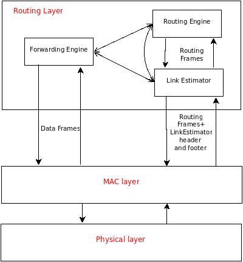

# Sensors Network Model

This simulation model is the result of a didactic project for the
<a href="http://www.dis.uniroma1.it/~hpdcs/index.php?option=com_content&view=article&id=22">
Concurrent and Parallel Programming</a> course of the Master of Science of
Engineering in Computer Science at <a href="http://cclii.dis.uniroma1.it/?q=it/msecs">Sapienza University of Rome</a>.
The author of this project is <a href="https://www.linkedin.com/in/leonidavide">Davide Leoni</a>.

<h2>Goal and Motivations</h2>

The goal of this project is to build a model to simulate the behaviour of <i>wireless sensor network (WSN)</i>: these networks consist of small devices featuring power source, a microprocessor, a wireless interface, some memory and one or more sensors. They are used to gather information from the sensors in a given location or region.
 Because of the limited radio communication range, nodes can communicate using <i>multi-hop routing protocols</i>
 Many alghorithms and protocols have been developed to collect data inside wireless sensors networks, and among these, the <i><b>Collection Tree Protocol (CTP)</b></i> is one of the most adopted for reaseach, teaching and commercial products. It has been already deployed in many real sensors networks and it has been implemented on different hardware platforms using various programming languages, from C to Java ( more about CTP is available <a href="http://sing.stanford.edu/gnawali/ctp/">here</a> ).
 This model provides a simulation of a WNS running the CTP and is meant to be run on the <a href="https://github.com/HPDCS/ROOT-Sim">ROme OpTimistic Simulator (ROOT-Sim)</a>.

<h2>Collection Tree Protocol</h2>
<h3>Overview</h3>

As already said, CTP is a <i>data collection</i> protocol for WNSs, so, just like the other protocols of such kind, it is based on (at least) one routing tree: the nodes are the devices featuring the sensors (that continuously collect physical data) and the links are the wireless 1-hop links among them; two nodes are neighbors if an edge exists between them.
 The root of the tree collects data packets that are forwarded by the other nodes of the tree. Each node forwards packets to its <i>parent</i>, chosen among its neighbor nodes. In order to make a choice, each node must be aware of the state of its neighbors: that's why nodes continuously broadcast special packets, called <i>beacons</i>, describing their condition.
  Data collection protocols differ in two aspects:
<ol>
<li>the <i>metric</i> used by the nodes to choose their parents</li>
<li>the capability of identifying and repairing critical situations like <i>routing loops</i></li>
</ol>
The main challenge for data collection protocols is represented by the fact that wireless links between nodes are not realiable; rather they are very instable.

<h3>Architecture</h3>

CTP consists of three main logical software components:
<ol>
<li><i><b>Link Estimator</b></i></li>
<li><i><b>Routing Engine</b></i></li>
<li><i><b>Forwarding Engine</b></i></li>
</ol>

The above picture shows the software components of a node running the Collection Tree Protocol: arrows between components show that there's interaction between them.
  The metric adopted in CTP for the selection of the parent node is the <i><b>ETX (Expected Transmissions)</b></i>: a node whose ETX is equal to <i>n</i> can deliver a data packet to the root node with an average of <i>n</i> transmissions.
 The ETX of any node is recursively defined as the ETX of its parent plus the ETX of its link to the parent; the root node represents the base case in this recursion, and its ETX is obviously equal to 0.
 Packets flow in the collection tree from the nodes to the root according to the gradient represented by ETX, from the leaf nodes, having the highest value of ETX, to the root of the node, where the ETX is 0.  
The ETX associated to a link is referred to as <i>1-hop ETX</i> and is computed by the Link Estimator; the ETX associated to a neighbor is referred to as <i>multi-hop ETX</i> (or simply ETX) and is the sum of the ETX declared by the neighbor (through its beacons) and the 1-hop ETX of the link to the neighbor.

<h3>Link Estimator</h3>

This is in charge of computing the incoming and outgoing quality of the links, in order to evaluate their 1-hop ETX.
 In particular, the <i>incoming quality</i> is calculated as the number of beacons sent by a neighbor over the number of beacons received by the same neighbor.
  The <i>outgoing quality</i> is the ratio between the number of data packets forwarded to a neighbor and the number of acknowledgements sent by this.
  Analyzing the headers and footers of beacons sent and received by the node, the Link Estimator builds and updates a table, the <i>link estimator table</i>, where it stores the 1-hop ETX of each neighbor node.

<h3>Routing Engine</h3>

This component is dedicated to the selection of the <i>parent</i> node, i.e. the neighbor with the lowest value of the multi-hop ETX.
  Since the multi-hop ETX is the sum of the 1-hop ETX and the ETX declared by neighbors in their beacons, the Routing Engine has to maintain a table, called <i>routing table</i>, where it stores the last ETX value read in the beacons from each neighbor : in this way, it is able to always choose the "best" neighbor (the one with the lowest multi-hop ETX) as parent.
 On one hand, the Routing Engine continuously updates the table reading the information contained in the beacons received from the neighbors, on the other hand it writes the ETX of the current parent in the beacons to be sent to the neighbors.
 This component is tightly coupled with the Link Estimator, since it needs to know, for each neighbor, the 1-hop ETX of the corresponding link. Their respective tables are also connected. For example, if the entry corresponding to a neighbor is removed from the link estimator table (probably because it is no longer reachable), the Routing Engine is forced to remove the entry corresponding to the neighbor also from the routing table.

<h3>Forwarding Engine</h3>

By mean of the Forwarding Engine, a node performs three tasks:
<ol>
<li align="justify">Forwards data packets received by its neighbors to the node that it has selected as parent; this, on its turn, will forward the packets to its own parent, so they will be finally delivered to the root of the collection tree</li>
<li align="justify">Detects and tries to fix <i>routing loops</i> (two or more nodes that send packets among each other forever, in such a way that the root will never receive them).</li>
<li align="justify">Detects and drops duplicate packets; this is achieved thanks to a cache where it stores the most recently sent data packets: before forwarding a packet, it checks whether there is one identical in the cache and, if so, drops the packet</li>
</ol>

<h2>The Simulation Model</h2>
<h3>Overview</h3>

There are many aspects that can be taken into account when developing a model of a WNS, depending on how accurate the simulation has to be. Some of them are:
<ol>
<li align="justify"><b>connectivity</b> -> given a node, only some other nodes, referred to as <i>neighbours</i>, are capable of communicating with it because of the limited range of wireless connections</li>
<li align="justify"><b>interferences</b> -> wireless links are not realiable because of characteristics of the physical medium, that suffers from phenomena like multipath propagation; links may also fail. Hence, a node may not correctly receive a message sent by a neighbor node</li>
<li align="justify"><b>knowledge of the nodes</b> -> if nodes run a <i>global algorithm</i> they are full aware of the state of all the other nodes; if the algorithm is <i>distributed</i>, nodes only know their own state when they start and they can learn about the state of their neighbours little by little by sending and receving packets.</li>
<li align="justify"><b>communication modes</b> -> nodes may be capable of sending only <i>broadcast</i> messages (received by all nodes within the range of the wireless transceiver), only <i>unicast</i> messages (received by one designed recipient) or both of them.</li>
<li align="justify"><b>network latency</b> -> the time between the moment when a message is sent and the moment when it is received</li>
<li align="justify"><b>topology of the network</b> -> the position of the nodes in the 2-dimensional or 3-dimensional space may be known before the simulation starts or it may be completely random</li>
<li align="justify"><b>reliability of nodes</b> -> the hardware featured by nodes is supposed to work under stated conditions for a certain period of time: after this period they are likely to fail. But nodes may also fail earlier if, for instance, they run out of energy or a some external disturbance occurs</li>
</ol>
Here's how the model proposed simulates the above aspects

<h3>Connectivity, interferences and topology</h3>

The model assumes that the <b>topology of the network is know a priori, before the simulation starts, and it has to be decided by the user of the simulator</b>; only the position of the node in the bi-dimensional plane is taken into account, not in the three dimensional space.
 The user only has to provide a text file containing as many rows as the number of nodes in the WSN. The syntax of each row is the following:

x,y

with "x" and "y" bi-dimensional coordinates of the node.
 Before the simulation actually starts, the simulator reads the list of coordinates of the nodes and stores it: from that point on, it is able to determine, for each node that sends a packet, which other nodes can receive it.
 Connectivity is in fact simulated according to a variation of the <i>Quasi Unit Disk Graph (QUDG)</i> model: <b>pairs of nodes with Euclidean Distance at most <i>p</i>, for some <i>p</i> in (0,<i>q</i>], with <i>q</i>><i>p</i>, are neighbors; pairs with a distance bigger than <i>q</i> are not neighbors, while pairs with a distance in (<i>p</i>,<i>q</i>] may or many not be neighbours.</b>
 In the first case, the simulator always delivers a message from the sender to the recipient, while in the second case the message will never be received.
 In the last case, the message is successfully delivered with a probability directly proportional to the distance between the nodes. In particular, a value in the range [0,<i>q</i>-<i>p</i>] is randomly chosen by the simulator and added to the value of the distance: the message is delivered only if the outcome is less than <i>q</i>.
 In other words, the model guarantees that <b>the closer two nodes are, the stronger is the wireless signal between them, so the better is the connectivity and the more likely is that messages sent by either of the two are successfully received.</b>
 <b>Interferences are represented by the random value added to the distance between the nodes because, just like interferences, it can unexpectedely prevent the communication between two nodes</b>.

<h3>Knowledge of the nodes</h3>

The Collection Tree Protocol is a <b>distributed algorithm</b>: as a node starts, it is only aware of its own state and coordinates, so it sends beacons to learn about its neighbours and about the topology of the collection tree.
 Nevertheless, a node has to know whether it has been chosen as the root of the collection tree or not. In the former case, in fact, it sets to 0 the value of the ETX in the beacons it sends to its neighbours, which is crucial because the ETX of the other nodes is recursively defined.
 Despite each node adheres to the CTP, the simulation model requires that the Logical Process associated with the node has access to two pieces of "global" information (see "Messages" for further details):
<ol>
<li align="justify">the number of nodes in the network</li>
<li align="justify">the coordinates of the other nodes</li>
</ol>

<h3>Communication modes</h3>

Nodes are modelled in such a way that they are <b>capable of sending both unicast messages and broadcast messages</b>.

<h3>Network latency</h3>

The network latency is modelled as a <b>constant offset between the moment when a node sends a packet, whatever its type</b> (data packet, beacon or ack) <b>and the moment when another node receives it</b>.
 Hence the latency is independent of the distance between nodes.

<h3>Reliability of nodes</h3>

Nodes are assumed to have an <b>exponential failure distribution</b>: at time <i>t</i>, the probability that a node is failed is equal to 1-e^(-<i>lambda</i> * <i>t</i>), where <i>lambda</i> is the multiplicative inverse of the <i>failure rate</i> of the nodes.
 Every time a node has to perform a step, <b>the simulator evaluates the probability of failure and adds a small random bias to it: if the result is bigger than a given threshold, the node is considered to be failed.</b>
 The random bias is necessary to model the fact that nodes don't usually fail after an exact working time, because external factors may anticipate or postpone the failure.

<h2>Implementation</h2>

<h3>Nodes</h3>

Each <i>Logical Processes (LP)</i> created by ROOT-Sim represents a node in the WSN, so this is associated with an instance of a top-level data structure named <i>node_state</i> that represents the state of the logical process during the simulation.
 Its fields contain two types of information:
<ol>
<li align="justify"><b>related to the simulation</b>: the local value of the <i>Global Virtual Time(GVT)</i>, the coordinates and ID of the node, a flag describing its state (running or failed, sending a packet...) and flag that is set to true only if the node is the root of the collection tree</li>
<li align="justify"><b>related to CTP</b>: the data structures corresponding to the three software components necessary to run the protocol (see "Collection Tree Protocol")</li>
</ol>
 A node periodically performs two tasks:
<ol>
<li align="justify"><b>gathers data from its sensor(s)</b>: data are represented by integer values randomly extracted in a predefined range</li>
<li align="justify"><b>sends a packet from its output queue</b>: either forwards a packet from another node or sends a packet containing data gathered by its own sensor(s)</li>
</ol>
 <b>The ID assigned by the simulator to an LP is used to determine univocally the sender and recipient of the messages exchanged in the network</b>.
<h3>Messages</h3>

<b>A node <i>x</i> that sends a packet to another node <i>y</i> is simulated by the Logical Process <i>x</i> scheduling a new event having the the Logical Process <i>y</i> as recipient</b>.
 Actually this holds only if the packet can be received by <i>y</i>, according to the model (see "Connectivity, interferences and position of the nodes"): if this is not the case, no event is scheduled, meaning that the packet is dropped.
 More precisely, when a node sends a packet, the corresponding Logical Process ultimately calls the function <i>is_message_received</i> (see "application.c"): this is given the IDs of the sender and recipient and returns true if the packet is can be delivered, false otherwise.
 The function relies on a global array where the <i>i</i>-th element contains the coordinates of the node with ID <i>i</i>.
 <b>The fact that such an array is available to all the LPs may seem in contrast with the above statement about the distribute nature of the Collection Tree Protocol. The contradiction can be explained by noting that nodes performs the step</b>
  The model actually gives the user the chance to decide the value of <i>p</i> and <i>q</i> (but if the former parameter is given by the user, also the latter has to be provided, and vice versa).

<h3>Input to the simulation</h3>

TOSSIM allows the user to define the topology of the network in terms of gain  of the links among all the pairs of nodes. The user has to option:
<ol>
<li align="justify">using data from a real network</li>
<li align="justify">deducing the gain values on the basis of the position of the nodes</li>
</ol>

TOSSIM comes with the java script <i>LinkLayerModel.java</i> to help the user in case he/she chooses the second option. The script requires a <i>configuration file</i> where the user can provide the following parameters:

<ol>
<li align="justify"><i>channel parameters</i> related to </li>
<li align="justify"><i>radio parameters</i></li>
<li align="justify"><i>radio parameters</i></li>
<li align="justify"><i>covariance matrix for hardware variance</i></li>
<li align="justify"><i>topology parameters</i></li>
</ol>

The user if free to provide none of these parameters, using their default values, some or all of them.
 In particular, as regards with the topology, the user can either provide its own x-y coordinates for all the nodes or let the script create them, choosing between three different distributions:

<ol>
<li align="justify"><i>grid</i></li>
<li align="justify"><i>uniform</i></li>
<li align="justify"><i>random</i></li>
</ol>

In case the user wants to provide its own list of coordinates, this has to be given in a different text file using the following syntax for the coordinates of each node:

node_id TAB x_coordinate TAB y_coordinate

The distance between any pair of nodes must be greater than or equal than the <i>inter-nodes distance</i> given among the channel parameters.
 

